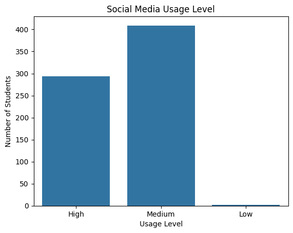
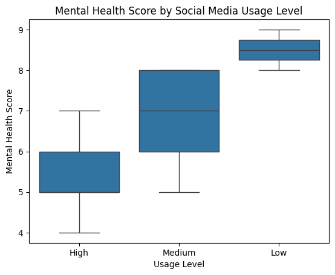
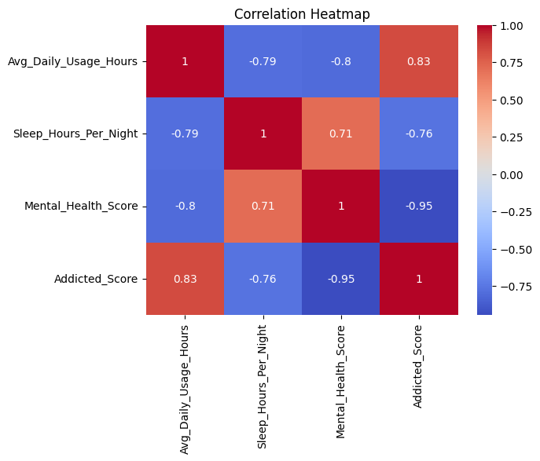

# Social Media Behavior Analysis

## Exploratory Data Analysis (EDA) Project

 ภาพรวมโครงการ (Project Overview)

โครงการนี้มีวัตถุประสงค์เพื่อวิเคราะห์ความสัมพันธ์ระหว่าง
พฤติกรรมการใช้งานโซเชียลมีเดีย สุขภาพจิต และความสัมพันธ์ระหว่างบุคคล
โดยใช้ข้อมูลแบบสอบถามจากโลกจริง (Real-world Dataset)

การวิเคราะห์มุ่งเน้นไปที่การค้นหาแพตเทิร์น (Patterns) และ Insight ที่ช่วยอธิบายว่า
การใช้งานโซเชียลมีเดียในระดับที่มากเกินไป อาจส่งผลกระทบต่อ:

สุขภาพจิตของนักศึกษา

ความสัมพันธ์ส่วนตัว

ชีวิตด้านการเรียนและการใช้ชีวิตประจำวัน

โครงการนี้จัดทำขึ้นเพื่อใช้เป็นการฝึกการวิเคราะห์ข้อมูลโดยเริ่มต้นการเรียนรู้ด้วยตัวเอง

## วัตถุประสงค์
- วิเคราะห์พฤติกรรมการใช้งานโซเชียลมีเดียของนักศึกษา
- ศึกษาความสัมพันธ์ระหว่างระดับการเสพติดโซเชียลมีเดียกับสุขภาพจิต
- วิเคราะห์ผลกระทบของโซเชียลมีเดียต่อความสัมพันธ์ระหว่างบุคคล
- ฝึกกระบวนการทำ Exploratory Data Analysis (EDA) ด้วย Python และข้อมูลจริง

## ชุดข้อมูล (Dataset)

แหล่งที่มา: Kaggle
ชื่อชุดข้อมูล: Social Media Addiction vs Relationships
🔗 https://www.kaggle.com/datasets/adilshamim8/social-media-addiction-vs-relationships

ตัวแปรสำคัญในชุดข้อมูล
| Column                      | Description                         |
| --------------------------- | ----------------------------------- |
| Age                         | อายุของผู้ตอบแบบสอบถาม              |
| Gender                      | เพศ                                 |
| Avg_Daily_Usage_Hours       | ชั่วโมงการใช้งานโซเชียลมีเดียต่อวัน |
| Mental_Health_Score         | คะแนนสุขภาพจิต (รายงานด้วยตนเอง)    |
| Sleep_Hours_Per_Night       | ชั่วโมงการนอนต่อคืน                 |
| Relationship_Status         | สถานะความสัมพันธ์                   |
| Conflicts_Over_Social_Media | ความขัดแย้งที่เกิดจากโซเชียลมีเดีย  |
| Addicted_Score              | ระดับการเสพติดโซเชียลมีเดีย         |

## เครื่องมือและทักษะที่ใช้ (Tools & Skills)

Python

Pandas

Matplotlib

Seaborn

Jupyter Notebook

Visual Studio Code (VS Code)

Exploratory Data Analysis (EDA)

Data Visualization

Insight & Data Storytelling

## ขั้นตอนการวิเคราะห์ (Analysis Workflow)

- โหลดข้อมูลและตรวจสอบโครงสร้างข้อมูล

- ตรวจสอบค่า Missing และความผิดปกติของข้อมูล

- วิเคราะห์สถิติเชิงพรรณนา (Descriptive Statistics)

- วิเคราะห์ตัวแปรเดี่ยว (Univariate Analysis)

- วิเคราะห์ตัวแปรเชิงหมวดหมู่ (Categorical Analysis)

- วิเคราะห์ความสัมพันธ์ระหว่างตัวแปร (Bivariate Analysis)

- สร้างกราฟเพื่ออธิบายข้อมูล (Visualization)

- สรุป Insight เชิงข้อมูล

## ตัวอย่างการวิเคราะห์และภาพประกอบ (Data Visualization)
**ระดับการใช้งานโซเชียลมีเดีย**

แสดงสัดส่วนผู้ใช้งานโซเชียลมีเดียในแต่ละระดับ เพื่อทำความเข้าใจพฤติกรรมผู้ใช้โดยรวม

**สุขภาพจิตเทียบกับระดับการใช้งานโซเชียล**

วิเคราะห์ความสัมพันธ์ระหว่างระดับการใช้งานโซเชียลมีเดียกับคะแนนสุขภาพจิต พบแนวโน้มว่าการใช้งานที่สูงขึ้นอาจส่งผลต่อสุขภาพจิต

**ชั่วโมงใช้โซเชียล vs ชั่วโมงการนอน**

แสดงความสัมพันธ์ระหว่างเวลาการใช้งานโซเชียลมีเดียต่อวันกับจำนวนชั่วโมงการนอน พบแนวโน้มการนอนลดลงเมื่อใช้โซเชียลมากขึ้น

**คะแนนสุขภาพจิตแยกตามสถานะความสัมพันธ์**

เปรียบเทียบคะแนนสุขภาพจิตของผู้ที่มีสถานะความสัมพันธ์แตกต่างกัน

## Insight สำคัญ (Key Insights)

- นักศึกษาที่ใช้โซเชียลมีเดียเป็นเวลานาน มีแนวโน้มคะแนนสุขภาพจิตลดลง

- ผู้ที่มีระดับการเสพติดโซเชียลมีเดียสูง รายงานว่ามีความขัดแย้งในความสัมพันธ์มากขึ้น

- การใช้งานโซเชียลมีเดียมากเกินไป อาจส่งผลกระทบเชิงลบทั้งด้านจิตใจและชีวิตส่วนตัว

## Business / Practical Impact

- ข้อมูลสามารถนำไปใช้ในการออกแบบแคมเปญส่งเสริมสุขภาพจิตในกลุ่มนักศึกษา

- ใช้เป็นแนวทางสำหรับสถาบันการศึกษาในการเฝ้าระวังพฤติกรรมเสพติดโซเชียลมีเดีย

- ช่วยให้ผู้พัฒนาแพลตฟอร์มเข้าใจผลกระทบของการใช้งานที่มากเกินไป

## แนวทางพัฒนาต่อยอด (Future Improvements)

- เพิ่มการวิเคราะห์เชิงสถิติ (Correlation / Hypothesis Testing)

- สร้างโมเดลทำนายความเสี่ยงการเสพติดโซเชียลมีเดีย

- พัฒนา Dashboard ด้วย Power BI หรือ Tableau

## Dashboard จาก Power BI

## ผู้จัดทำ (Author)

Dolthida Klakhaeng
Aspiring Data Analyst
📍 Thailand
